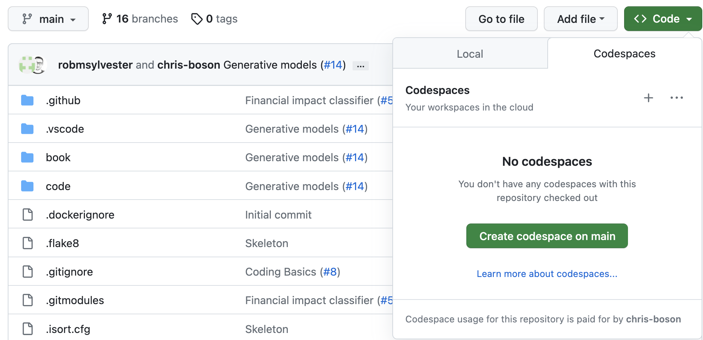

# Development Environment Setup
## Codespaces
Easiest way to get started is to use GitHub Codespaces to set up the deleopment environment and run an instance in the cloud.
You have a generous amount of free credits to use for this purpose.

- Go to https://github.com/chris-boson/epilepsy, click on `Code` and select the `Codespaces` tab.
   
- Click on `Create codespace on main`
- A new browser or VSCode window will open (you can set your preference [here](https://github.com/settings/codespaces)).
- Wait for it to be loaded. It will take a few minutes.

## Local
- Go to https://github.com/chris-boson/epilepsy, click on `Code` and select the `Local` tab.
- Copy the URL under HTTPS
- Clone the repository in your local machine
  - On Mac / Linux the git CLI is pre-installed and you can just run `git clone https://github.com/chris-boson/epilepsy.git`
  - On Windows we recommend using [GitHub Desktop](https://desktop.github.com/)
- Make sure you have `python3.8` installed in your system
- Install [VSCode](https://code.visualstudio.com/)
- Run `make setup-dev`
- Open a new terminal and run `poetry install`

## Running the code
- **Open the workspace**
  - When asked to open the workspace, click `Open Workspace`
    
  - Otherwise you can open it manually by hitting Cmd + Shift + P -> `Open workspace from file` and select `epilepsy.code-workspace`.
- Navigate in the terminal, for example to `code/CodingBasics` and run `poetry install`.
